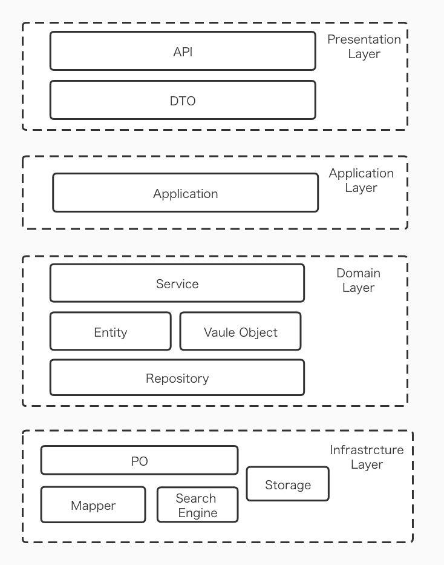
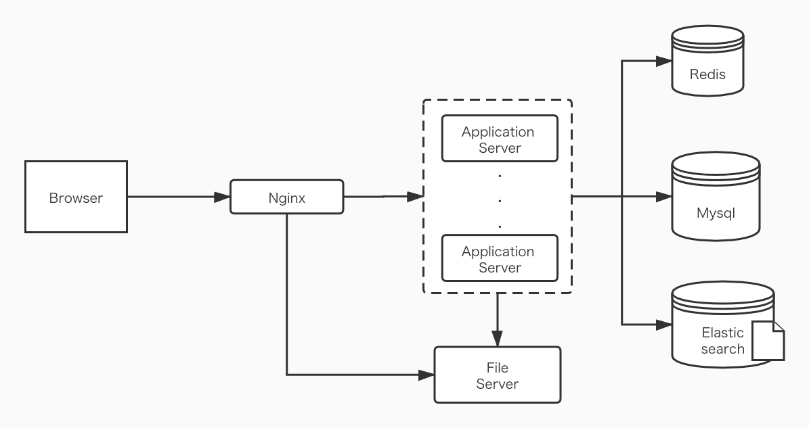

# Smart Post

A question and answer site using spring boot. I am trying to apply DDD(Domain Driven Design) to it. I mainly applied my own understanding by reading some resources and examples rather than trying to make a perfect ddd example.

This project mainly uses

- Spring Boot
- Spring Security
- Mybatis + Mysql
- Swagger
- Elasticsearch
- Redis
- Docker

# How to run

Make sure following are installed

- docker
- maven
- Node.js

To run application

1. Download the [Frontend](https://github.com/bin-jump/question-answer-front) project also, and run the `build.sh` file. Then, copy the files generated in `dist` folder to `presentation/src/main/resources/static` folder.

1. Then run `build.sh` to package the project.

1. Run the following command to run docker compose

   > docker-compose up -d

1. To stop, run
   > docker-compose down -v

# Function description

This site allows user to post questions and answers. Each question can be followed or liked and each answer can be upvoted or downvoted. Comment can be add to questions and answers. Also, user can search content of question or answer by keywords.

User has to register and signin to post question or answer. User can also follow other user to get feeds from other user. The profile of the account can be edit at any time.

A chat system can be used to chat with other users. User can search user by their name and start a new chat with anyone.

# DDD layers

The design principle of the application is different from transditional three layer architecture. In ddd principle, the domain layer container the core business logic and all other layers depend on it. The domain layer is divided with concept of aggragation and each aggragate is basicly a group of eneities with meaningful relations.

Below the domain layer is infrastructure layer which contains most of the infrastructure that server other layers. The domain eneities will be covert to PO and in infrastructure layer we will manipulate only those POs. This layer directly connect with the outside services such as relational database, storage, search engine, message queue etc.

Above domain layer is application layer that coordinate different aggragates. It is pretty thin and do not contain too much logic.

Top most layer is presentation layer that used to communicate with frontend. The domain entities will be covert to DTOs and in presentation layer we will manipulate only the DTOs. The presentation layer mainly handles the UI related logic and things like authentication. This layer may also query to database with directly talk to infrastructure layer.

I know the design is pretty debatable, I am just doing with my understanding.

# Architecture

The following diagram shows the basic architecture of the application. In front of the application server is an nginx server play as revert proxy. Application server has no state at all so it is duplicatable(by modifying docker-compose and nginx configration file).

File server to save user image is comprised of an nginx server running in a ftp server. Application server will save the user image by ftp connection while nginx will send image to frontend. It is a naive design and I shall replace it with a scalable solution.

For storage, redis ,mysql and elasticsearch are used. Redis is just used to store sessions and mysql is used to store data. For searching question and answer, elasticsearch is used as an search engine.

# UI

For frontend, please refer to [Frontend](https://github.com/bin-jump/question-answer-front).
